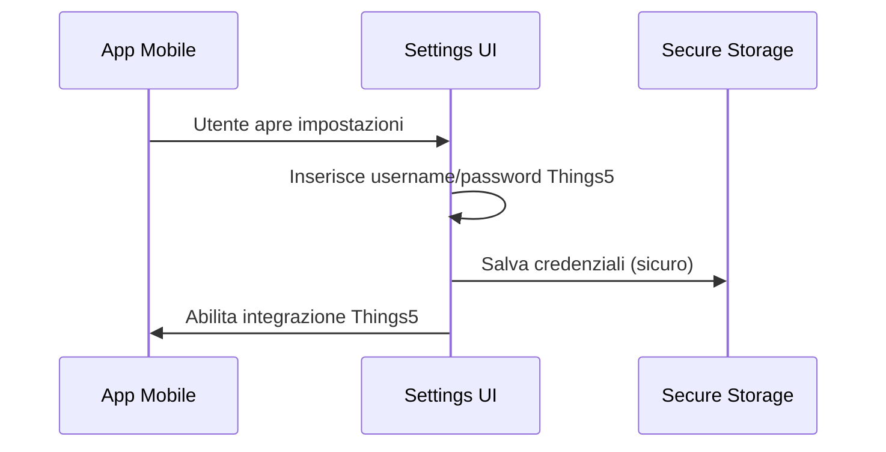
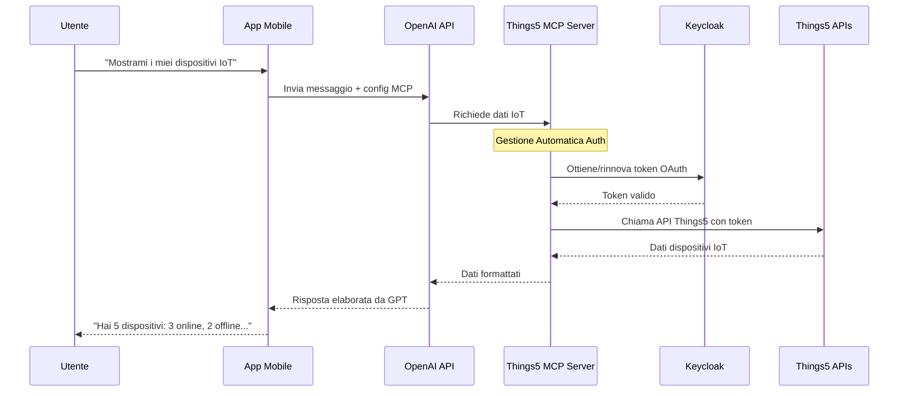

# Architettura e Flusso - Things5 MCP Integration

## 🏗️ **Architettura Semplificata**

```
┌─────────────────┐    ┌──────────────────┐    ┌─────────────────┐    ┌─────────────────┐
│                 │    │                  │    │                 │    │                 │
│   APP MOBILE    │───▶│    OPENAI API    │───▶│  THINGS5 MCP    │───▶│  THINGS5 APIs   │
│                 │    │                  │    │     SERVER      │    │   + KEYCLOAK    │
│ • Username/Pass │    │ • GPT-4o Model   │    │ • Auth Manager  │    │ • Device APIs   │
│ • Chat UI       │    │ • MCP Tools      │    │ • Token Refresh │    │ • OAuth Tokens  │
│ • Settings      │    │ • Responses      │    │ • API Calls     │    │ • IoT Data      │
│                 │    │                  │    │                 │    │                 │
└─────────────────┘    └──────────────────┘    └─────────────────┘    └─────────────────┘
```

## 🔄 **Flusso di Autenticazione**

### **1. Setup Iniziale (Una volta)**


### **2. Chat con IoT (Ogni messaggio)**


## 📱 **Implementazione App Mobile - Step by Step**

### **Step 1: UI Configuration**
```typescript
// Schermata impostazioni - 5 minuti di sviluppo
interface Things5Settings {
  enabled: boolean;           // Toggle on/off
  serverUrl: string;         // Pre-compilato
  username: string;          // Input utente
  password: string;          // Input sicuro
  connectionStatus: string;  // Indicatore stato
}
```

### **Step 2: OpenAI Integration**
```typescript
// Integrazione OpenAI - 10 minuti di sviluppo
class ChatService {
  async sendMessage(message: string, things5Config: Things5Settings) {
    const tools = [];
    
    // Se Things5 è abilitato, aggiungi il tool MCP
    if (things5Config.enabled) {
      tools.push({
        type: "mcp",
        server_label: "things5",
        server_url: `${things5Config.serverUrl}?username=${things5Config.username}&password=${things5Config.password}`,
        require_approval: "never"
      });
    }
    
    // Invia a OpenAI
    const response = await openai.responses.create({
      model: "gpt-4o",
      tools: tools,
      input: message
    });
    
    return response.output_text;
  }
}
```

### **Step 3: Error Handling**
```typescript
// Gestione errori - 5 minuti di sviluppo
try {
  const response = await chatService.sendMessage(message, things5Config);
  return response;
} catch (error) {
  if (error.message.includes('authentication')) {
    return "❌ Credenziali Things5 non valide. Controlla le impostazioni.";
  }
  return "❌ Errore di connessione. Riprova più tardi.";
}
```

## 🔧 **Configurazioni Server**

### **URLs Disponibili:**

| Ambiente | URL | Descrizione |
|----------|-----|-------------|
| **Produzione** | `https://things5-mcp-server.onrender.com/sse` | Server live per app in produzione |
| **Staging** | `https://things5-mcp-server-staging.onrender.com/sse` | Per test pre-rilascio |
| **Development** | `http://localhost:3000/sse?no_auth=true` | Sviluppo locale senza auth |

### **Parametri di Configurazione:**

```typescript
// Configurazione flessibile per diversi ambienti
const CONFIG = {
  production: {
    mcpServerUrl: "https://things5-mcp-server.onrender.com/sse",
    requireAuth: true,
    timeout: 30000
  },
  staging: {
    mcpServerUrl: "https://things5-mcp-server-staging.onrender.com/sse", 
    requireAuth: true,
    timeout: 45000
  },
  development: {
    mcpServerUrl: "http://localhost:3000/sse?no_auth=true",
    requireAuth: false,
    timeout: 60000
  }
};
```

## 🎯 **Cosa Fa il Server MCP (Automaticamente)**

### **Gestione Autenticazione:**
- ✅ Riceve username/password dall'app
- ✅ Ottiene token OAuth da Keycloak
- ✅ Rinnova automaticamente token prima scadenza
- ✅ Gestisce refresh token
- ✅ Retry automatici su errori temporanei

### **Gestione API Things5:**
- ✅ Chiama 38+ API Things5 diverse
- ✅ Gestisce paginazione e filtri
- ✅ Formatta dati per OpenAI
- ✅ Cache intelligente per performance
- ✅ Error handling e logging

### **Integrazione OpenAI:**
- ✅ Protocollo MCP standard
- ✅ SSE (Server-Sent Events) per OpenAI
- ✅ Gestione sessioni
- ✅ Tool registration automatico
- ✅ Response formatting

## 📊 **Metriche e Monitoring**

### **Cosa Monitorare nell'App:**
```typescript
interface Things5Metrics {
  connectionStatus: 'connected' | 'disconnected' | 'error';
  lastSuccessfulCall: Date;
  totalIoTQueries: number;
  averageResponseTime: number;
  authErrors: number;
}
```

### **Health Check:**
```typescript
async function checkThings5Health(): Promise<boolean> {
  try {
    const response = await fetch('https://things5-mcp-server.onrender.com/health');
    return response.ok;
  } catch {
    return false;
  }
}
```

## 🚀 **Timeline Sviluppo**

### **Stima Tempi Implementazione:**

| Task | Tempo Stimato | Descrizione |
|------|---------------|-------------|
| **UI Settings** | 2-3 ore | Form username/password, toggle, status |
| **OpenAI Integration** | 1-2 ore | Configurazione MCP tool |
| **Error Handling** | 1 ora | Gestione errori auth/connessione |
| **Secure Storage** | 1 ora | Salvataggio sicuro credenziali |
| **Testing** | 2-3 ore | Test integrazione e edge cases |
| **UI Polish** | 1-2 ore | Indicatori stato, UX refinement |

**Totale: 8-12 ore di sviluppo**

## 💡 **Tips per Sviluppatori**

### **1. Start Simple:**
```typescript
// Versione minima funzionante (15 minuti)
const mcpTool = {
  type: "mcp",
  server_url: "https://things5-mcp-server.onrender.com/sse?username=test@example.com&password=testpass"
};
```

### **2. Add Security:**
```typescript
// Versione sicura (30 minuti)
const mcpTool = {
  type: "mcp", 
  server_url: "https://things5-mcp-server.onrender.com/sse",
  authorization: `Basic ${btoa(`${username}:${password}`)}`
};
```

### **3. Add Polish:**
```typescript
// Versione completa (2-3 ore)
class Things5Integration {
  // Gestione stato, cache, retry, UI feedback, etc.
}
```

---

## 🎯 **Riassunto Tecnico**

**Per l'app mobile è SEMPLICISSIMO:**

1. **Raccogli** username/password dall'utente *(5 min)*
2. **Configura** OpenAI con URL server MCP *(10 min)*  
3. **Gestisci** errori di base *(5 min)*

**Il server MCP fa tutto il resto automaticamente!**

- 🔐 OAuth, token, refresh
- 🌐 API calls Things5  
- 📊 Data processing
- 🔧 Error handling
- ⚡ Performance optimization

**Risultato: Integrazione IoT enterprise-grade con ~20 righe di codice!** 🚀
